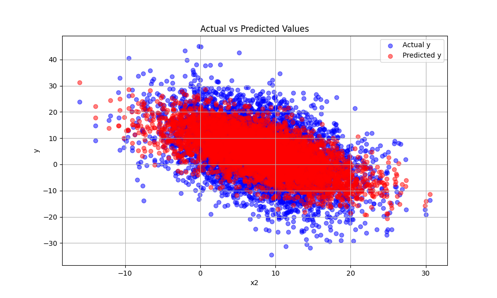
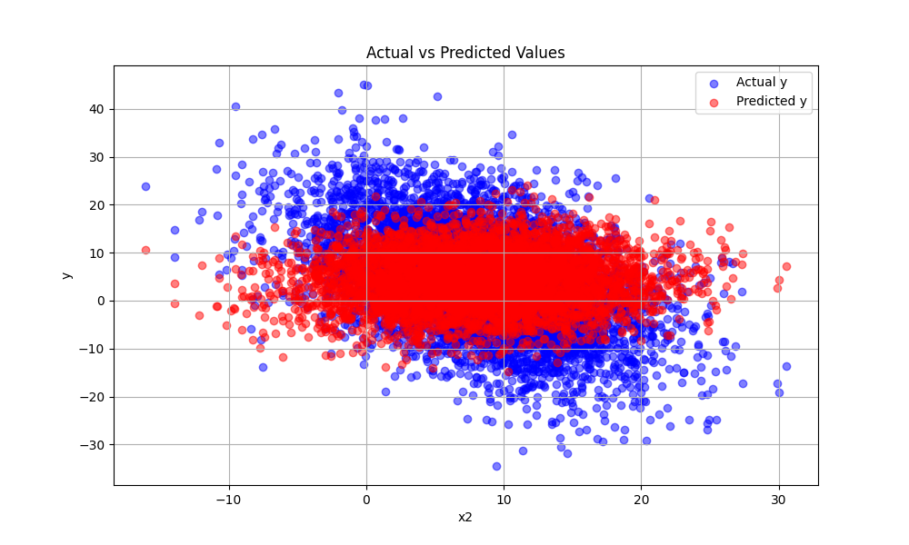

# Linear Regression Model

## Version 2.0 released

Uses the two most correlated features to train the model, `x2` and `x4`, to predict `y`. Compared to version 1.0, the model is more accurate, now using 2 input features instead of 1. Version 1.0 only used the `x4` feature with these coefficients:

$$ y = -1.22445664*x4 + 8.750705153951522$$

Version 2.0 uses the `x2` and `x4` features with these coefficients:

$$ y = -0.84009006*x2 -1.26146834*x4 + 15.745003662592282$$

This does a much better job of predicting `y` with a reduction in the mean squared error from 83.21 to 55.83, a 33% reduction!

### Model v2.0 Predictions

### Model v1.0 Predictions

